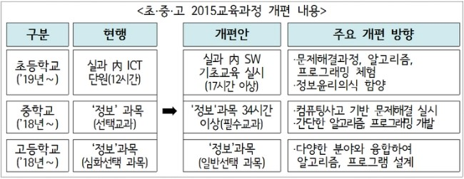

> ## Prerequisites {.prereq}
>
> * [교육부·미래부,「SW중심사회를 위한 인재양성 추진계획」발표](http://m.blog.naver.com/moeblog/220426677439)
> * [중앙일보 사설 - 교사도 없이 소프트웨어 가르치겠다는 정신 나간 정부](http://article.joins.com/news/article/article.asp?total_id=18289368&cloc=olink|article|default)

> ## 성큼 다가선 미래 {.getready}
>
> "The future is here, it's just not evenly distributed yet."
>                                                                     - William Gibson

- 게임
    - [드론 경주](https://www.youtube.com/watch?v=47LRsDMkDWc)
    - [RC카 경주](https://www.youtube.com/watch?v=Kaqd1NIWm7Q)
- 물류
    - [아마존(Amazon Kiva)](http://www.youtube.com/watch?v=aI_YQp3zoo8&amp;list=PL16A39FD504A786B1&amp;index=8)
    - [아마존 택배(Amazon Prime Air)](http://www.youtube.com/watch?v=98BIu9dpwHU)
- 자동차
    - [구글 무인자동차(Google Self-Driving Car)](http://www.youtube.com/watch?v=cdgQpa1pUUE)
    - [우버(Uber) 택시](http://www.youtube.com/watch?v=P2M0RD7bhYY)
- 호텔 
    - [에어비앤비(AirBnB)](http://www.youtube.com/watch?v=SaOFuW011G8)
- **[로봇과 일자리 경쟁](https://www.youtube.com/watch?v=7c_XO3Ouzts)**
    - [Oxford Martin School study shows nearly half of US jobs could be at risk of computerisation](http://www.futuretech.ox.ac.uk/news-release-oxford-martin-school-study-shows-nearly-half-us-jobs-could-be-risk-computerisation)

## Topics

1.  [컴퓨팅 사고력과 소프트웨어 교육](ct-korea.html)
2.  [이제 글을 쓰는 것은 소프트웨어 개발이다!](ct-writing.html)

## 참고자료

*   [컴퓨터과학 언플러그드](http://www.xwmooc.net/computationalthinking/unplugged/index.html)
*   [소프트웨어 카펜트리](http://www.xwmooc.net/swcarpentry/swc/book.html)
*   [R 팩키지](http://r-pkgs.xwmooc.net/)
